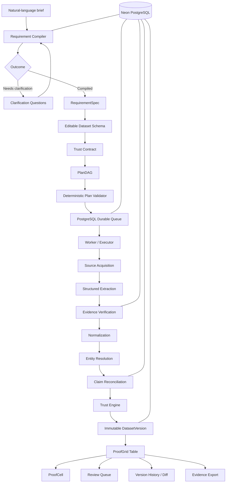

<div align="center">

# ProofGrid

### Turn a question into a dataset you can prove.

**Evidence-first AI data intelligence for structured research, due diligence, and trustworthy dataset creation.**

Built for **Code Cubicle 6.0**


> **LLM plans. Code executes. Evidence proves. PostgreSQL owns truth.**

</div>

---

## Table of contents

- [What is ProofGrid?](#what-is-proofgrid)
- [Why ProofGrid exists](#why-proofgrid-exists)
- [What makes it different](#what-makes-it-different)
- [Quick start — run the prototype](#quick-start--run-the-prototype)
- [First-time setup](#first-time-setup)
- [Environment configuration](#environment-configuration)
- [Database setup](#database-setup)
- [Start all three services](#start-all-three-services)
- [How to use the prototype](#how-to-use-the-prototype)
- [Golden demo flow](#golden-demo-flow)
- [How ProofGrid works internally](#how-proofgrid-works-internally)
- [Trust model](#trust-model)
- [ProofCell](#proofcell)
- [Conflict preservation](#conflict-preservation)
- [Architecture](#architecture)
- [Repository structure](#repository-structure)
- [Tech stack](#tech-stack)
- [Testing](#testing)
- [Security boundaries](#security-boundaries)
- [Troubleshooting](#troubleshooting)
- [Demo mode vs live mode](#demo-mode-vs-live-mode)
- [Current hackathon scope](#current-hackathon-scope)
- [Roadmap](#roadmap)

---

# What is ProofGrid?

ProofGrid is an **evidence-first AI data intelligence platform**.

A user describes the dataset they need in natural language. ProofGrid then turns that request into a structured, validated, versioned dataset where important values can be traced back to preserved source claims and evidence.

Instead of producing only an AI-generated answer, ProofGrid produces a **dataset you can inspect and defend**.

```text
Natural-language question
        ↓
Requirement Compiler
        ↓
Editable Dataset Schema
        ↓
Trust Contract
        ↓
Validated PlanDAG
        ↓
Workflow Execution
        ↓
Source Acquisition
        ↓
Structured Extraction
        ↓
Evidence Verification
        ↓
Normalization
        ↓
Entity Resolution
        ↓
Claim Reconciliation
        ↓
Categorical Trust
        ↓
Immutable Dataset Version
        ↓
ProofGrid Table
        ↓
ProofCell / Review / Diff / Export
```

---

# Why ProofGrid exists

Research tools are good at producing answers.

They are much weaker at producing a dataset that can be trusted later.

A normal AI-assisted research workflow can leave you with:

- values copied into a spreadsheet without durable provenance,
- citations attached to paragraphs instead of individual fields,
- conflicting sources silently collapsed into one answer,
- assumptions hidden inside prompts,
- no explicit definition of what counts as trustworthy,
- no reproducible execution plan,
- no immutable dataset history,
- and no easy way to answer:

> **Why does this exact cell contain this exact value?**

ProofGrid is built around that question.

---

# What makes it different

| Typical AI research workflow | ProofGrid |
|---|---|
| Produces an answer | Produces a structured dataset |
| Citation is attached to prose | Evidence can be inspected per cell |
| Conflicting sources may be hidden | Conflicting claims are preserved |
| Trust is vague | Trust rules are explicit |
| Prompt immediately triggers generation | User reviews schema + Trust Contract first |
| Execution is opaque | PlanDAG is inspectable before running |
| Results change informally | Dataset versions are immutable |
| Export loses provenance | Export bundles data + evidence + manifest |

The central principle is:

> **A value should never look more certain than its evidence allows.**

---

# Quick start — run the prototype

If the project is already installed and your `.env` files are configured, you only need **three terminals**.

## Terminal 1 — Backend API

```bash
cd /path/to/ProofGrid/backend
.venv/bin/uvicorn app.main:app --host 127.0.0.1 --port 8000
```

A successful startup should include:

```text
Application startup complete.
```

The API runs at:

```text
http://127.0.0.1:8000
```

---

## Terminal 2 — Background worker

Open a new terminal:

```bash
cd /path/to/ProofGrid/backend
.venv/bin/python worker/main.py
```

**Keep this terminal running.**

The worker is mandatory. Without it, newly submitted workflows may remain in:

```text
QUEUED
```

---

## Terminal 3 — Frontend

Open another terminal:

```bash
cd /path/to/ProofGrid
pnpm --filter @proofgrid/web dev --hostname 127.0.0.1 --port 3000
```

Open:

```text
http://127.0.0.1:3000
```

You should now see the ProofGrid evidence workspace.

---

# First-time setup

Use this section if you are cloning and running ProofGrid for the first time.

## Requirements

Recommended local tools:

- Git
- Node.js 20+
- pnpm
- Python 3.12
- `uv`
- a PostgreSQL database / Neon PostgreSQL project

Check:

```bash
node --version
pnpm --version
python3.12 --version
uv --version
git --version
```

---

## 1. Clone the repository

```bash
git clone https://github.com/Udit-Agarwal20/ProofGrid.git
cd ProofGrid
```

---

## 2. Install frontend dependencies

From the repository root:

```bash
pnpm install
```

---

## 3. Install backend dependencies

```bash
cd backend
uv sync
cd ..
```

`uv sync` creates/synchronizes the backend virtual environment from the Python project definition.

If you prefer a manual virtual environment:

```bash
cd backend
python3.12 -m venv .venv
.venv/bin/pip install -e .
cd ..
```

The project commands below assume the environment is located at:

```text
backend/.venv
```

---

# Environment configuration

ProofGrid has separate backend and frontend runtime configuration.

**Never commit real secrets.**

---

## Backend environment

Create or edit:

```text
backend/.env
```

For the most reliable hackathon/demo flow:

```env
APP_ENV=local

AI_PROVIDER=fixture
SEARCH_PROVIDER=fixture
ACQUISITION_MODE=FIXTURE
FIXTURE_SET=synthetic

CORS_ORIGINS=["http://localhost:3000","http://127.0.0.1:3000"]

DATABASE_URL=YOUR_POOLED_POSTGRESQL_CONNECTION_STRING
DATABASE_DIRECT_URL=YOUR_DIRECT_POSTGRESQL_CONNECTION_STRING
```

### Database URLs

With Neon:

- `DATABASE_URL` → pooled runtime connection
- `DATABASE_DIRECT_URL` → direct/unpooled connection for migrations/admin operations

Do not publish these values.

### Optional AI providers

The backend also supports provider-based compilation modes such as:

```env
AI_PROVIDER=groq
```

or:

```env
AI_PROVIDER=gemini
```

These require their corresponding API keys.

For a hackathon demo, `fixture` mode is recommended because it is deterministic and does not depend on upstream model availability.

---

## Frontend environment

Create:

```text
apps/web/.env.local
```

Add:

```env
NEXT_PUBLIC_API_BASE_URL=http://127.0.0.1:8000
```

Do **not** put database URLs, worker secrets, Groq keys, Gemini keys, or other private credentials into `NEXT_PUBLIC_*` variables.

Anything prefixed with `NEXT_PUBLIC_` can be exposed to the browser.

---

# Database setup

Before running the prototype for the first time, make sure the database exists and your backend environment variables are configured.

From the backend directory:

```bash
cd backend
.venv/bin/alembic upgrade head
cd ..
```

This applies the current database migrations.

You can then verify the backend.

Start the API and use:

```bash
curl http://127.0.0.1:8000/health/live
```

For database readiness:

```bash
curl http://127.0.0.1:8000/health/ready
```

A successful readiness response means the application can reach its configured database.

---

# Start all three services

ProofGrid is intentionally split into three local processes:

```text
┌───────────────────────┐
│  Next.js Web Client   │
│  127.0.0.1:3000       │
└───────────┬───────────┘
            │ HTTP + SSE
            ▼
┌───────────────────────┐
│  FastAPI Backend      │
│  127.0.0.1:8000       │
└───────────┬───────────┘
            │
            ▼
┌───────────────────────┐
│ Neon PostgreSQL       │
│ + durable queue       │
└───────────┬───────────┘
            ▲
            │ claims jobs
┌───────────┴───────────┐
│ Background Worker     │
└───────────────────────┘
```

### Start order

Use this order:

1. Backend API
2. Worker
3. Frontend

This makes debugging easier.

---

# How to use the prototype

This section explains the full user workflow.

## Step 1 — Open Ask

Open:

```text
http://127.0.0.1:3000
```

The first screen is the **Ask** workspace.

You can either:

- type your own research brief, or
- click one of the built-in example briefs.

Recommended example:

```text
Find Indian AI startups that raised more than $1M in the last 12 months.
Include company, website, founders, headquarters, funding round,
funding amount, investors, funding date, and original evidence.
```

Click:

```text
Compile request
```

---

## Step 2 — Interpretation Studio

ProofGrid converts the natural-language brief into a structured requirement.

You can inspect and edit:

- dataset objective,
- entity type,
- geography,
- record limit,
- date range,
- requested fields,
- field types,
- required/optional fields,
- filters,
- assumptions,
- ambiguities.

This is important because ProofGrid does not immediately start collecting data.

The user first approves **what the dataset should mean**.

When ready, click:

```text
Review trust contract
```

---

## Step 3 — Trust Contract

The Trust Contract defines what evidence the system must respect.

Depending on the requirement, the contract can encode rules around:

- required evidence,
- source count,
- corroboration,
- source independence,
- conflict preservation,
- missing values,
- human review,
- execution limits.

The Trust Contract prevents “AI confidence” from silently replacing explicit evidence policy.

When ready, click:

```text
Confirm contract & build plan
```

---

## Step 4 — Plan Preview

ProofGrid builds a constrained execution graph called a **PlanDAG**.

The plan shows what the system intends to do before it actually executes.

Typical pipeline stages include:

```text
Acquire sources
      ↓
Extract candidate facts
      ↓
Verify evidence
      ↓
Normalize values
      ↓
Resolve entities
      ↓
Reconcile claims
      ↓
Assign trust
      ↓
Materialize version
```

Inspect the plan, then click:

```text
Run workflow
```

---

## Step 5 — Run Monitor

After starting the workflow, ProofGrid opens the run monitor.

The backend creates durable work records in PostgreSQL, and the worker executes them.

The frontend receives persisted progress events using **Server-Sent Events (SSE)**.

You can watch steps transition through states such as:

```text
QUEUED
RUNNING
SUCCEEDED
FAILED
PARTIAL
CANCELLED
```

When the run finishes successfully, click:

```text
Open dataset
```

---

## Step 6 — ProofGrid dataset

The dataset screen is the main analytical workspace.

It supports:

- structured rows and columns,
- search,
- sorting,
- filtering,
- dataset-version selection,
- trust-state badges,
- clickable evidence-aware cells.

Each important value can carry a trust state.

To inspect why a value exists, click the cell.

---

## Step 7 — ProofCell

A **ProofCell** is the evidence view for one dataset value.

It can display:

- canonical value,
- trust status,
- source claims,
- source URL,
- retrieved timestamp,
- publication date,
- raw value,
- normalized value,
- evidence excerpt,
- evidence-anchor type,
- claim ID,
- raw document ID,
- source ID,
- SHA-256 content hash,
- source classification,
- validation flags,
- resolution metadata,
- conflicting claims.

ProofCell is the answer to:

> **Why does this exact cell contain this value?**

---

## Step 8 — Conflict review

When sources disagree, ProofGrid does not silently choose one and discard the rest.

A conflicting field is marked:

```text
CONFLICTING
```

Open the ProofCell to compare preserved claims.

A reviewer can select a display preference for a future version while historical evidence remains unchanged.

---

## Step 9 — Version history

Datasets are versioned.

A refresh creates a new `DatasetVersion` instead of rewriting history.

This makes it possible to inspect:

- current version,
- previous versions,
- changed records,
- changed field values,
- changed trust states,
- the workflow run that generated a version.

---

## Step 10 — Export

Open the **Export** tab.

Choose a format:

```text
CSV
```

or:

```text
JSON
```

Click:

```text
Download ZIP bundle
```

A normal evidence bundle contains:

```text
dataset.csv / dataset.json
evidence.json
manifest.json
```

The export is pinned to a specific dataset version.

---

# Golden demo flow

For judges, reviewers, or a first-time evaluator, use the deterministic demo path.

### Prompt

```text
Find Indian AI startups that raised more than $1M in the last 12 months.
Include company, website, founders, headquarters, funding round,
funding amount, investors, funding date, and original evidence.
```

### Flow

```text
Ask
 ↓
Interpretation
 ↓
Editable Schema
 ↓
Trust Contract
 ↓
Plan Preview
 ↓
Run Workflow
 ↓
Live SSE Events
 ↓
Open Dataset
 ↓
Click Funding Amount
 ↓
Inspect ProofCell
 ↓
Show Conflict
 ↓
Review
 ↓
Export ZIP
```

The deterministic fixture intentionally includes two conflicting synthetic funding claims:

```text
First-party source: $4.5M
Press source:       $5.0M
```

This is useful because it demonstrates one of ProofGrid's most important behaviors:

> **It preserves disagreement instead of hiding it.**

The demo company is synthetic; the conflicting numbers are not presented as claims about a real company.

---

# How ProofGrid works internally

## 1. Requirement Compiler

The compiler converts a user's natural-language brief into structured contracts.

It separates two outcomes:

```text
COMPILED
NEEDS_CLARIFICATION
```

If a blocking ambiguity exists, ProofGrid can ask a clarification question instead of fabricating a complete requirement.

The compiler does **not** directly execute arbitrary model output.

---

## 2. RequirementSpec

The RequirementSpec represents what the user actually wants.

It captures concepts such as:

- objective,
- entity,
- geography,
- time window,
- filters,
- requested fields,
- limits,
- source hints.

The frontend exposes this structure so a human can correct it before execution.

---

## 3. Dataset Schema

The schema defines the output structure.

Each field can include:

- internal key,
- display label,
- type,
- description,
- required/optional status.

This keeps the final dataset predictable and machine-readable.

---

## 4. Trust Contract

The Trust Contract defines what evidence is acceptable.

This is separate from the dataset schema because:

```text
"What columns do I want?"
```

and:

```text
"What makes a value trustworthy?"
```

are different questions.

ProofGrid makes both explicit.

---

## 5. PlanDAG

The planner turns the confirmed requirement into a constrained Directed Acyclic Graph.

The plan is validated deterministically.

The execution boundary rejects unsupported operators and arbitrary executable code.

The model can help describe a plan, but deterministic code decides what can actually run.

---

## 6. Durable queue

Runs are not executed inside the browser request.

The backend persists work into PostgreSQL.

The separate worker claims queued work and performs pipeline steps.

This is why the worker process must remain running.

The durable queue gives ProofGrid a foundation for:

- retries,
- leases,
- cancellation,
- recovery,
- persisted run state.

---

## 7. Source acquisition

ProofGrid can operate using different acquisition strategies.

For the hackathon golden path, fixture mode is used for reliability.

The architecture also supports captured/public sources and live acquisition adapters.

External content is always treated as untrusted input.

---

## 8. Structured extraction

Raw source material is converted into candidate claims.

A claim is not automatically considered true.

It must still pass evidence and reconciliation stages.

---

## 9. Evidence Anchor Verification

Evidence is connected to the exact raw source representation.

Supported anchor shapes include:

```text
TEXT_SPAN
JSON_POINTER
DOM_SELECTOR
STRUCTURED_FIELD
```

This allows ProofGrid to verify that an extracted claim is actually represented in the captured source.

A hallucinated quote should not be able to earn a strong trust state.

---

## 10. Normalization

Raw values are transformed into consistent forms.

Examples:

```text
"$4.5 million" → structured money value
"Sep 30, 2026" → normalized date
```

ProofGrid preserves the relationship between:

```text
raw value
→ normalized value
```

rather than pretending the normalized value appeared exactly that way in the source.

---

## 11. Entity resolution

Multiple documents can describe the same real-world entity.

ProofGrid attempts conservative matching.

Ambiguous matches can be surfaced for review rather than aggressively merged.

---

## 12. Claim reconciliation

Multiple claims for the same entity + field are preserved.

The reconciliation layer asks:

- Do sources agree?
- Are they independent?
- Is one source first-party?
- Is evidence valid?
- Do values conflict?
- Is review required?

This stage determines the canonical display value without deleting the claim history.

---

## 13. Trust engine

Trust is categorical.

ProofGrid does not rely on a single opaque AI-generated confidence percentage.

The canonical states are:

```text
VERIFIED
SUPPORTED
SINGLE_SOURCE
CONFLICTING
NEEDS_REVIEW
MISSING
```

---

## 14. Immutable DatasetVersion

The final dataset is materialized as a versioned snapshot.

A later refresh creates a new version.

Historical versions remain inspectable.

---

## 15. SSE event stream

The run monitor receives ordered workflow events through Server-Sent Events.

The implementation supports persisted event sequencing and replay behavior so the UI can recover progress after a reconnect.

---

## 16. Evidence export

Exports combine the user-facing dataset with the underlying provenance.

That turns the export from:

```text
"here is a spreadsheet"
```

into:

```text
"here is the dataset, its evidence, and the manifest that ties the snapshot together"
```

---

# Trust model

ProofGrid uses six canonical states.

| State | Meaning |
|---|---|
| `VERIFIED` | Evidence satisfies the strongest configured requirements |
| `SUPPORTED` | Useful corroboration exists but does not reach the highest tier |
| `SINGLE_SOURCE` | Only one usable source currently supports the value |
| `CONFLICTING` | Preserved sources disagree materially |
| `NEEDS_REVIEW` | Human judgment is required |
| `MISSING` | No defensible value is currently available |

Color is not the only indicator; the UI also uses text/symbols.

---

# ProofCell

ProofCell is one of the central product concepts.

Traditional datasets store:

```text
row + column → value
```

ProofGrid extends that idea:

```text
row + column
      ↓
canonical value
      ↓
trust status
      ↓
preserved claim ledger
      ↓
evidence anchors
      ↓
raw source/document metadata
```

This makes provenance inspectable at the same level of detail as the dataset.

---

# Conflict preservation

ProofGrid intentionally keeps contradictions visible.

If one source says:

```text
$4.5M
```

and another says:

```text
$5.0M
```

ProofGrid can preserve:

- both values,
- both sources,
- both evidence anchors,
- both retrieval histories,
- the resolution metadata,
- the human review decision.

The system can still display a canonical value, but it does not pretend the disagreement disappeared.

---

# Architecture



### Architectural doctrine

```text
LLM plans.
Code executes.
Evidence proves.
PostgreSQL owns truth.
```

The model is not the database and is not treated as the ultimate source of truth.

---

# Repository structure

```text
ProofGrid/
│
├── apps/
│   └── web/
│       ├── app/                 # Next.js application routes
│       ├── components/
│       │   ├── brief/           # Ask, interpretation, schema, trust
│       │   ├── dataset/         # Grid, versions, export
│       │   ├── proof/           # ProofCell / evidence drawer
│       │   ├── review/          # Human review queue
│       │   ├── shell/           # Workspace shell
│       │   ├── ui/              # Shared UI primitives
│       │   └── workflow/        # Plan preview and run monitor
│       ├── lib/
│       │   ├── api/             # Typed API client and SSE
│       │   └── hooks/
│       └── test/
│
├── backend/
│   ├── app/
│   │   ├── ai/                  # Requirement compiler providers
│   │   ├── api/                 # FastAPI routes and contracts
│   │   ├── application/
│   │   │   ├── acquisition/
│   │   │   ├── datasets/
│   │   │   ├── execution/
│   │   │   ├── extraction/
│   │   │   ├── planning/
│   │   │   └── requirement_compiler/
│   │   ├── core/
│   │   ├── db/
│   │   ├── domain/
│   │   ├── fixtures/
│   │   └── persistence/
│   ├── alembic/
│   ├── scripts/
│   ├── tests/
│   └── worker/
│
├── docs/
│   └── build/
│       ├── BACKEND_IMPLEMENTATION_REPORT.md
│       ├── FRONTEND_RECOVERY_AUDIT.md
│       └── SUBMISSION_READINESS_REPORT.md
│
├── compose.yaml
├── pnpm-lock.yaml
└── README.md
```

---

# Tech stack

## Frontend

- Next.js 15
- React 19
- TypeScript
- Tailwind CSS
- Vitest
- Server-Sent Events
- IBM Plex Sans
- IBM Plex Mono
- IBM Plex Serif
- custom **Forensic Ledger** design system

## Backend

- Python 3.12
- FastAPI
- Pydantic v2
- SQLAlchemy 2
- Alembic
- psycopg
- pytest
- Ruff
- mypy

## Data / infrastructure

- Neon PostgreSQL
- PostgreSQL-backed durable queue
- immutable dataset versions
- persisted workflow/run state
- fixture, captured-source, and live-provider architecture
- optional Groq/Gemini requirement compiler adapters

---

# Testing

## Complete backend quality gate

From repository root:

```bash
make check
```

During the hardened hackathon release, the main backend suite completed successfully.

---

## Frontend tests

```bash
pnpm --filter @proofgrid/web test
pnpm --filter @proofgrid/web typecheck
pnpm --filter @proofgrid/web lint
pnpm --filter @proofgrid/web build
```

The hardened frontend release was verified with:

```text
Vitest       34 / 34 passing
TypeScript   0 errors
ESLint       0 warnings / errors
Next build   PASS
```

---

## Focused backend release verification

The submission rehearsal also verified focused backend contract/e2e coverage and a complete browser journey.

The latest release reports are available in:

```text
docs/build/
```

---

# Security boundaries

ProofGrid treats acquired external content as untrusted.

Important backend boundaries include:

- SSRF protection,
- unsafe scheme rejection,
- URL-credential rejection,
- loopback/private/reserved/metadata-network protection,
- DNS and redirect validation,
- response-size limits,
- robots policy handling,
- project scoping,
- parameterized SQL,
- secret redaction,
- sanitized API errors.

The application does not attempt to bypass:

- CAPTCHA,
- paywalls,
- authentication walls,
- explicit source restrictions.

Frontend code must never contain private provider keys or database credentials.

---

# Troubleshooting

This section covers the most common local issues.

---

## 1. Backend says `address already in use`

Example:

```text
ERROR: [Errno 48] address already in use
```

Check which process already owns port 8000:

```bash
lsof -nP -iTCP:8000 -sTCP:LISTEN
```

If it is already the correct ProofGrid backend, **do not start another backend**.

If it is a stale process, stop it:

```bash
kill <PID>
```

Then start the API again.

---

## 2. Frontend port 3000 is already used

```bash
lsof -nP -iTCP:3000 -sTCP:LISTEN
```

Stop only the stale process:

```bash
kill <PID>
```

Then restart the frontend.

---

## 3. Run stays in `QUEUED`

The worker is probably not running.

Start:

```bash
cd backend
.venv/bin/python worker/main.py
```

Keep that terminal open.

---

## 4. Frontend cannot reach backend / CORS error

Make sure the frontend URL and backend CORS settings agree.

Backend:

```env
CORS_ORIGINS=["http://localhost:3000","http://127.0.0.1:3000"]
```

Frontend:

```env
NEXT_PUBLIC_API_BASE_URL=http://127.0.0.1:8000
```

Restart both frontend and backend after changing environment variables.

---

## 5. Check whether backend is alive

```bash
curl -i http://127.0.0.1:8000/health/live
```

---

## 6. Check database readiness

```bash
curl -i http://127.0.0.1:8000/health/ready
```

If readiness fails, inspect your database environment configuration.

---

## 7. Compile button appears disabled

If the browser restored old textarea text but the character counter still shows:

```text
0 / 12,000
```

the visible browser value may not yet be synchronized with React state.

Fix:

1. clear the textarea,
2. type/paste again, or
3. click the built-in **Indian AI funding** example.

The counter should become non-zero before clicking:

```text
Compile request
```

---

## 8. Workflow runs but no dataset button appears immediately

Wait for the run to reach its terminal state.

The worker needs time to materialize the dataset version.

If execution is complete but the page has not updated, refresh the run view.

---

## 9. Migration / schema issue

Apply migrations:

```bash
cd backend
.venv/bin/alembic upgrade head
```

Then restart the API and worker.

---

## 10. Fixture demo does not behave deterministically

Check:

```env
AI_PROVIDER=fixture
SEARCH_PROVIDER=fixture
ACQUISITION_MODE=FIXTURE
FIXTURE_SET=synthetic
```

Restart:

- API,
- worker,
- frontend.

---

# Demo mode vs live mode

ProofGrid deliberately separates reliability from experimentation.

## Deterministic fixture mode

Recommended for the hackathon prototype.

```env
AI_PROVIDER=fixture
SEARCH_PROVIDER=fixture
ACQUISITION_MODE=FIXTURE
FIXTURE_SET=synthetic
```

Why it exists:

- deterministic behavior,
- no external model outage,
- predictable evidence,
- reproducible conflict demo,
- fast judging experience.

The fixture is not simply a hardcoded final table.

It still passes through the downstream ProofGrid pipeline for:

- extraction,
- evidence verification,
- normalization,
- reconciliation,
- trust assignment,
- dataset versioning,
- ProofCell,
- review,
- export.

---

## Captured-source mode

Publicly captured source material can be replayed through the pipeline while preserving source bytes/hashes.

This is useful for reproducible source-backed testing without depending on a live website during a demo.

---

## Live mode

The architecture also supports live provider/search/acquisition paths.

However, the current hackathon release intentionally prioritizes a **narrow, deeply verified path** over pretending broad-web research is production-ready.

That tradeoff is deliberate.

---

# Current hackathon scope

The current prototype already demonstrates:

- natural-language requirement compilation,
- clarification-aware compiler behavior,
- editable schema,
- Trust Contract,
- constrained PlanDAG,
- durable asynchronous execution,
- SSE run events,
- evidence-backed dataset generation,
- six-state categorical trust,
- per-cell ProofCell inspection,
- conflict preservation,
- human review,
- immutable versions,
- version-aware export.

Intentionally not required for the core hackathon flow:

- full browser automation,
- CAPTCHA bypass,
- paywall/auth-wall bypass,
- large-scale distributed workers,
- Qdrant dependency,
- n8n orchestration dependency,
- production observability infrastructure,
- broad autonomous web browsing.

---

# Verified hackathon release

The hardened submission path was verified end-to-end:

```text
Ask
→ Compile
→ Interpretation
→ Schema
→ Trust Contract
→ PlanDAG
→ Durable Queue
→ Worker
→ SSE Stream
→ Dataset
→ ProofCell
→ Conflict Review
→ ZIP Export
```

Release checks included:

| Check | Result |
|---|---|
| Frontend tests | PASS |
| TypeScript | PASS |
| ESLint | PASS |
| Production build | PASS |
| Focused backend contract tests | PASS |
| Database readiness | PASS |
| Golden browser journey | PASS |
| SSE stream | PASS |
| ProofCell | PASS |
| Conflict review | PASS |
| ZIP export | PASS |
| Browser runtime errors during rehearsal | 0 critical errors |

See:

```text
docs/build/SUBMISSION_READINESS_REPORT.md
```

for the detailed release record.

---

# Roadmap

Potential next steps:

- broader live-source support,
- richer source-routing policy,
- improved publication-date extraction,
- stronger entity-resolution models,
- optional vector-assisted matching,
- collaborative review workflows,
- scheduled dataset refresh,
- richer dataset diff UX,
- production deployment near the database,
- tracing and observability,
- multi-project authentication/authorization,
- richer export/report formats.

The invariant will remain:

> **Never make a value look more certain than its evidence allows.**

---

# Hackathon

Built for **Code Cubicle 6.0**.

ProofGrid is designed to demonstrate that AI-assisted research can be:

- structured,
- inspectable,
- reproducible,
- conflict-aware,
- evidence-native,
- and exportable without losing provenance.

---

<div align="center">

## ProofGrid

### Turn a question into a dataset you can prove.

**LLM plans · Code executes · Evidence proves · PostgreSQL owns truth**

</div>
