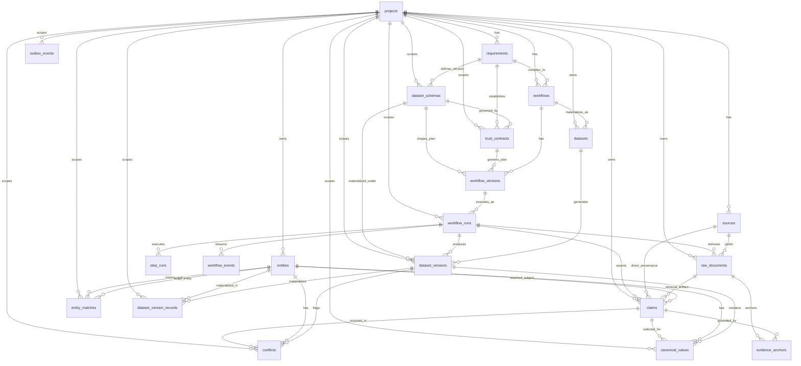

# ProofGrid Database Entity-Relationship Diagram (ERD)

> **Phase 2B Authoritative Schema**: 21 relational tables modeling the multi-tenant write model, provenance ledger, reproducible workflow versions, entity resolution, version-scoped canonical truth, and materialized read model.



---

## Conceptual Invariants & Relational Integrity

### 1. Dataset Versioning & Schema Hierarchy
```
Dataset (Stable Logical Identity: id, project_id, workflow_id, name, slug)
    ↓
DatasetVersion (Historical Immutable Snapshot: dataset_id, dataset_schema_id, workflow_run_id, version_number)
    ↓
DatasetSchema (Exact Contract: schema_definition, version_number, requirement_id)
```
- **Stable Identity**: `datasets` has **no** `schema_id`. A dataset evolves through multiple schema versions across its lifetime.
- **Materialized Identity**: `dataset_versions.dataset_schema_id` directly identifies the exact schema under which records were produced.

### 2. Trust Contract Governs Exact Dataset Schema
```
Requirement
    ↓
DatasetSchema vN (schema_definition, version_number)
    ↓
TrustContract vN (dataset_schema_id, contract_definition, version_number)
```
- A Trust Contract governs an accepted `DatasetSchema`, not merely an abstract requirement. `trust_contracts.dataset_schema_id` is `NOT NULL` with `ON DELETE RESTRICT`.

### 3. Claim Ledger Provenance
```
Source (Logical Source URL/Domain Identity)
  ↑ (source_id: direct source provenance for fast ledger queries)
Claim (Claim Ledger Entry)
  ↓ (raw_document_id: specific immutable retrieval artifact snapshot)
RawDocument
  ↓ (entity_id: nullable; allows pre-resolution extraction persistence)
Entity (Resolved Canonical Entity)
```
- **Dual Provenance**: A claim explicitly links to both `source_id` (logical origin) and `raw_document_id` (concrete retrieval artifact).
- **Extraction Before Resolution**: `entity_id` is nullable. Claims are persisted immediately upon extraction and linked to canonical entities upon resolution.


---

## Model Inventory & Tables (21 Business Tables)

| Module | Table Name | Purpose | Immutability Class | Primary Constraints |
| :--- | :--- | :--- | :--- | :--- |
| `project.py` | `projects` | Logical workspace and tenant boundary | Mutable | `PK(id)`, `UQ(slug)` |
| `requirement.py` | `requirements` | Prompt & compiled RequirementSpec snapshot | Mutable before execution | `PK(id)`, `FK(project_id)`, `CK(status)` |
| `requirement.py` | `dataset_schemas` | User-confirmed dataset schema definition | Immutable | `PK(id)`, `FK(project_id)`, `FK(requirement_id)`, `UQ(requirement_id, version_number)` |
| `requirement.py` | `trust_contracts` | Accepted quality/evidence/budget contract | Immutable | `PK(id)`, `FK(project_id)`, `FK(requirement_id)`, `FK(dataset_schema_id)`, `UQ(requirement_id, version_number)` |
| `workflow.py` | `workflows` | Reusable workflow logical identity | Mutable | `PK(id)`, `FK(project_id)`, `FK(requirement_id)`, `CK(status)` |
| `workflow.py` | `workflow_versions` | Immutable compiled PlanDAG snapshot | Immutable | `PK(id)`, `FK(workflow_id)`, `FK(dataset_schema_id)`, `FK(trust_contract_id)`, `UQ(workflow_id, version_number)` |
| `workflow.py` | `workflow_runs` | Execution state, budgets, and metrics | Mutable lifecycle | `PK(id)`, `FK(project_id)`, `FK(workflow_version_id)`, `CK(status, run_mode)` |
| `workflow.py` | `step_runs` | Queue state and node attempt execution | Mutable lifecycle | `PK(id)`, `FK(workflow_run_id)`, `UQ(workflow_run_id, node_id, attempt)`, `CK(status, operator_type)` |
| `workflow.py` | `workflow_events` | Append-only SSE progress and audit events | Append-only | `PK(id)`, `FK(workflow_run_id)`, `UQ(workflow_run_id, sequence_number)` |
| `evidence.py` | `sources` | Canonical source URL/domain identity | Mutable metadata | `PK(id)`, `FK(project_id)`, `UQ(project_id, canonical_url)` |
| `evidence.py` | `raw_documents` | Immutable content-addressed retrieval snapshot | Immutable | `PK(id)`, `FK(project_id)`, `FK(source_id)`, `FK(workflow_run_id)`, `IX(project_id, content_hash)` (Non-Unique) |
| `evidence.py` | `claims` | Append-only source assertions (Claim Ledger) | Append-only | `PK(id)`, `FK(project_id)`, `FK(raw_document_id)`, `FK(source_id)`, `FK(workflow_run_id)`, `FK(entity_id)` |
| `evidence.py` | `evidence_anchors` | Verifiable text/JSON/DOM locators | Append-only | `PK(id)`, `FK(claim_id)`, `FK(raw_document_id)`, `CK(anchor_type, verification_status)` |
| `entity.py` | `entities` | Resolved canonical real-world entity | Mutable | `PK(id)`, `FK(project_id)`, `UX(project_id, stable_entity_key)` |
| `entity.py` | `entity_matches` | Pairwise entity merge/review decisions | Immutable audit | `PK(id)`, `FK(project_id)`, `FK(source_entity_id)`, `FK(target_entity_id)`, `CK(source_entity_id < target_entity_id)`, `UQ(project_id, source_entity_id, target_entity_id)` |
| `dataset.py` | `datasets` | Logical output dataset identity | Mutable | `PK(id)`, `FK(project_id)`, `FK(workflow_id)`, `UQ(project_id, slug)` |
| `dataset.py` | `dataset_versions` | Versioned dataset generation snapshot | Immutable once finalized | `PK(id)`, `FK(project_id)`, `FK(dataset_id)`, `FK(dataset_schema_id)`, `FK(workflow_run_id)`, `UQ(dataset_id, version_number)` |
| `dataset.py` | `canonical_values` | Derived field read model with trust state | Version-scoped | `PK(id)`, `FK(project_id)`, `FK(dataset_version_id)`, `FK(entity_id)`, `FK(selected_claim_id)`, `UQ(dataset_version_id, entity_id, field_key)` |
| `dataset.py` | `conflicts` | Unresolved/resolved field disagreements | Version-scoped | `PK(id)`, `FK(project_id)`, `FK(dataset_version_id)`, `FK(entity_id)`, `FK(resolved_claim_id)`, `UQ(dataset_version_id, entity_id, field_key)` |
| `dataset.py` | `dataset_version_records`| Materialized record read model for grid UI | Version-scoped | `PK(id)`, `FK(project_id)`, `FK(dataset_version_id)`, `FK(entity_id)`, `UQ(dataset_version_id, entity_id)` |
| `outbox.py` | `outbox_events` | Transactional outbox for Qdrant/webhooks | Mutable status | `PK(id)`, `FK(project_id)`, `CK(status, attempt_count)` |
