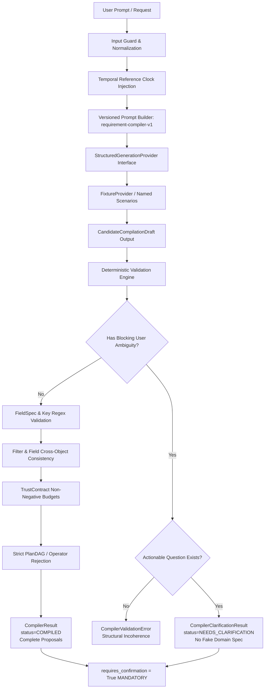

# Phase 3A Build Report: Requirement Compiler Foundation

**Phase**: 3A — Requirement Compiler Foundation (Structured Compilation + Provider Abstraction + Fixture Mode)
**Status**: COMPLETE / VERIFIED
**Baseline Checkpoint**: `48b9dd0fb921cee4070b41c6550a1087460b9683`
**Database Migration HEAD**: `9727a73ca3e4` (Unchanged, 0 migrations created)

---

## 1. Goal

The objective of ProofGrid Phase 3A is to construct the foundational architecture for the **Requirement Compiler**. The Requirement Compiler translates a user's natural-language data request into:
1. Validated canonical `RequirementSpec`
2. Proposed canonical `DatasetSchema` (with deterministic SHA-256 `schema_hash`)
3. Proposed canonical `TrustContract` (with quality rules and execution budgets)
4. Explicit, typed `Ambiguity` findings (`code`, `field_path`, `message`, `severity`: `INFO`/`WARNING`/`BLOCKING`, `blocking: bool`, `possible_interpretations`)
5. Explicit, typed `Assumption` declarations (`code`, `description`, `affected_field`, `reversible: bool`)
6. Concise, actionable `ClarificationQuestion` items for material ambiguities
7. Discriminated compilation outcome: `CompilerResult` for complete proposals vs `CompilerClarificationResult` when blocking user ambiguities exist
8. Mandatory confirmation-required boundary (`requires_confirmation = True`)

This entire compilation pipeline operates strictly offline in Phase 3A using a deterministic provider abstraction (`StructuredGenerationProvider`) and fixture implementation (`FixtureProvider`), requiring zero network calls and zero vendor LLM SDKs (OpenAI, Gemini, Anthropic).

---

## 2. Compiler Architecture & Discriminated Compilation Outcome

The compiler strictly adheres to the core architectural doctrine:
```
LLM PROPOSES.
DETERMINISTIC CODE VALIDATES.
USER CONFIRMS.
```

### Discriminated Compilation Outcome (`CompilationOutcome`)

To prevent weakening `RequirementSpec` with placeholder values (e.g. `entity_type = "unknown"`), the compiler emits a discriminated union outcome:

```python
CompilationOutcome = CompilerResult | CompilerClarificationResult
```

1. **`CompilerResult`** (Complete Proposal):
   - `status`: `"COMPILED"`
   - `requirement_spec`: Complete, validated canonical `RequirementSpec`
   - `dataset_schema_proposal`: Complete, validated canonical `DatasetSchema`
   - `trust_contract_proposal`: Complete, validated canonical `TrustContract`
   - `ambiguities`: Surfaced non-blocking or resolvable `Ambiguity` items
   - `assumptions`: Explicit `Assumption` items
   - `clarification_questions`: Questions attached to ambiguities
   - `requires_confirmation`: Always `True`
   - `metadata`: Compiler runtime metadata

2. **`CompilerClarificationResult`** (Needs Clarification):
   - `status`: `"NEEDS_CLARIFICATION"`
   - Emitted strictly when blocking user ambiguity prevents the creation of a valid `RequirementSpec`
   - Contains **NO fabricated `RequirementSpec`**, **NO schema proposal**, and **NO trust contract proposal**
   - `ambiguities`: At least one `BLOCKING` ambiguity attributable to the user request
   - `assumptions`: Recorded assumptions if any
   - `clarification_questions`: At least one actionable `ClarificationQuestion`
   - `partial_context`: Typed `ClarificationContext` (safely capturing partial entity/fields without domain model corruption)
   - `requires_confirmation`: Always `True`
   - `metadata`: Compiler runtime metadata

### Compiler Pipeline Diagram



---

## 3. Package Boundaries & Module Structure

The Requirement Compiler is cleanly isolated in `backend/app/application/requirement_compiler` and `backend/app/ai`:

```
backend/app/
├── ai/
│   ├── __init__.py                 # AI provider exports
│   ├── contracts.py                # StructuredGenerationRequest, ProviderMetadata
│   ├── exceptions.py               # AIProviderError hierarchy
│   ├── provider.py                 # StructuredGenerationProvider protocol
│   └── fixture_provider.py         # Deterministic offline scenario provider
└── application/
    └── requirement_compiler/
        ├── __init__.py             # RequirementCompiler exports
        ├── models.py               # CompilationOutcome, CompilerResult, CompilerClarificationResult, Ambiguity, etc.
        ├── errors.py               # RequirementCompilerError hierarchy (sanitized)
        ├── prompts.py              # Versioned prompt assembly (requirement-compiler-v1)
        ├── validation.py           # Deterministic post-validation and semantic consistency
        └── service.py              # RequirementCompiler application service & persistence
```

No compiler logic is placed inside API routes, ORM models, repositories, or background workers.

---

## 4. Distinguishing User Ambiguity from Provider Invalidity

A critical architectural distinction is enforced between **Provider Structural Invalidity** and **Genuine User-Level Blocking Ambiguity**:

| Situation | Root Cause | Validation Behavior | Outcome |
| :--- | :--- | :--- | :--- |
| **Provider Invalidity** | Provider outputs `entity_type = ""` with NO structured ambiguity explaining that the prompt is unclear; duplicate field keys; unsupported types; negative budgets; PlanDAG operators | Deterministic rejection of malformed provider response | `CompilerValidationError` raised |
| **User Ambiguity** | User prompt is genuinely underspecified ("Find the best ones in India" with missing entity; contradictory required constraints) | Structured `BLOCKING` ambiguity and actionable `ClarificationQuestion` returned by provider | `CompilerClarificationResult` emitted |

This distinction prevents masking provider bugs as normal user clarification dialogues, while ensuring ambiguous users receive a helpful clarification experience without internal validation crashes.

---

## 5. Relative Time & Injectable Clock Strategy

### Deterministic Temporal Reference Architecture
The Requirement Compiler never calls uncontrolled `datetime.now()` scattered across business logic and contains no hardcoded 2025 calendar dates. Relative temporal expressions (e.g. "last 18 months") are resolved through an injectable temporal reference clock:

1. **`CompilationContext`**: Accepts an explicit `reference_date: datetime` (defaults to current UTC datetime in production).
2. **Metadata Transparency**: The compiler runtime records the exact `reference_date` (formatted as `YYYY-MM-DD`) in `CompilerMetadata.reference_date`.
3. **Prompt Delivery**: The reference date is explicitly injected into the structured generation prompt metadata (`current_reference_date`).
4. **Golden Fixture Reference Date**: The golden fixture is explicitly pinned to reference date `2025-03-01`. For an 18-month trailing request, it resolves deterministically to:
   $$\text{start} = 2023-09-01, \quad \text{end} = 2025-03-01$$
5. **Deterministic Shift Tests**: Injecting `2024-06-01` shifts the window dynamically to `2022-12-01 → 2024-06-01`.

---

## 6. Ambiguous Assumptions Remain Explicit & Unconfirmed

For requests such as *"Find the best recent AI startups in India"*:
- Interpretations like `ASSUME_TOP_FUNDED` (interpreting "best" as highest total funding) and `ASSUME_RECENCY_24M` (interpreting "recent" as founded within the past 24 months) are **never silently transformed into confirmed facts**.
- They are preserved strictly as explicit, typed `Assumption` objects with `reversible = True`.
- Corresponding `Ambiguity` records (`SUBJECTIVE_BEST`, `AMBIGUOUS_RECENCY`) are surfaced.
- Actionable `ClarificationQuestion` items are linked to these ambiguities.
- `requires_confirmation = True` remains unconditionally set. Downstream execution cannot treat them as confirmed user intent.

---

## 7. Version Allocation Concurrency Safety

When saving revisions to existing requirements, the persistence layer determines the next draft version number (`latest_version + 1`). To eliminate race conditions without unbounded loops:

1. **Database Integrity Boundary**: PostgreSQL `UNIQUE` constraints (`uq_dataset_schemas_requirement_version`, `uq_trust_contracts_requirement_version`) act as the final, immutable integrity boundary.
2. **Bounded Retry Strategy**:
   - The application attempts to persist the atomic draft in a single Unit of Work transaction.
   - If a concurrent write commits first, the database raises a uniqueness conflict (`PersistenceConflictError`).
   - The transaction is rolled back completely.
   - When provided with a UnitOfWork factory (`Callable[[], AbstractUnitOfWork]`), the service opens a **fresh UnitOfWork**, re-queries the latest version, and retries.
   - **Bounded Limit**: Retries are capped at a maximum of **3 attempts**.
   - After 3 failed attempts, a sanitized `PersistenceConflictError` is raised.
   - **Unrelated Errors**: Non-version conflicts (e.g., foreign key violations) are never retried and fail immediately.

---

## 8. Persistence Boundary for Blocked Compilations

`RequirementCompiler.persist_compilation_draft` enforces a strict persistence boundary:
- Only complete `CompilerResult` proposals can be persisted as `Requirement.status = "COMPILED"`.
- Passing a `CompilerClarificationResult` immediately raises `CompilerValidationError`.
- Incomplete clarification outcomes **never create `DatasetSchema` rows, never create `TrustContract` rows, and never enqueue a `requirement.compiled` outbox event**.
- Blocked compilations remain in application memory for interactive dialogue resolution.

---

## 9. FixtureProvider Scenarios

`FixtureProvider` provides 100% offline, deterministic simulation of provider candidate generation across 12 scenarios:
1. `golden_indian_ai_funding`: Full showcase dataset request with dynamically computed trailing 18-month window based on injected `reference_date` (defaulting to pinned `2025-03-01`).
2. `ambiguous_startups`: Prompt "Find the best recent AI startups in India", surfacing subjective ranking and recency ambiguities with clarification questions and unconfirmed assumptions.
3. `blocking_contradiction`: Contradictory dates (e.g. start 2024 after end 2020), correctly surfacing a `BLOCKING` ambiguity and clarification question.
4. `blocking_user_ambiguity_missing_entity`: Prompt "Find the best ones in India" with missing identifiable entity, producing a `CompilerClarificationResult` with actionable questions.
5. `missing_entity`: Malformed provider response (empty entity with no ambiguity explanation), triggering `CompilerValidationError`.
6. `invalid_duplicate_fields`: Proposes duplicate field keys (`company_name` twice), rejected by post-validation.
7. `invalid_unsupported_field_type`: Proposes `unsupported_binary_blob`, rejected by post-validation.
8. `invalid_negative_budget`: Proposes negative crawl budget, rejected by post-validation.
9. `invalid_plandag_injection`: Proposes workflow operators (`FETCH_HTTP`), rejected by post-validation.
10. `provider_timeout`: Simulates provider timeout, translated to `CompilerProviderError`.
11. `provider_failure`: Simulates connection failure, translated to `CompilerProviderError`.
12. `prompt_injection_inert`: Verifies adversarial prompts remain inert data.

---

## 10. Verification Gates & Test Results

### Offline Unit & Contract Tests
- Command: `make test-compiler`
- Results: **35 passed in 0.38s** (100% passing)
  - Clear request + malformed provider missing entity → `CompilerValidationError`
  - Genuinely ambiguous request (missing entity) → `CompilerClarificationResult`
  - Clarification result contains blocking ambiguity, clarification question, `requires_confirmation = True`
  - Clarification result does NOT create fake `RequirementSpec`
  - Clarification result cannot be persisted as `COMPILED`
  - Temporal reference injection tests: identical results on same reference date, dynamic shift on shifted reference date
  - Unconfirmed assumption tests: `ASSUME_TOP_FUNDED` / `ASSUME_RECENCY_24M` remain explicit and unconfirmed
  - Version conflict retry tests: simulated version conflict retries with fresh UoW, bounded retry stops at limit (3 attempts), unrelated integrity error is not retried

### Full Phase Verification Gate
- Command: `make check`
  - Backend Linting (`ruff check app worker tests`): **PASSED**
  - Backend Formatting (`ruff format --check app worker tests`): **PASSED**
  - Web Frontend Linting: **PASSED**
  - Backend Typechecking (`mypy app worker tests`): **PASSED** (58 source files clean)
  - Web Frontend Typechecking: **PASSED**
  - Offline Unit & Contract Test Suite: **90 passed**
  - Web Frontend Tests (`vitest`): **2 passed**
  - Web Frontend Production Build (`next build`): **PASSED**
- Overall `make check`: **ALL GATES PASSED**

### Neon Database Integration Tests
- Command: `make test-db`
- Results: **35 passed**
  - Includes `test_neon_compiler_draft_persistence_atomic_commit` (PASSED)
  - Includes `test_neon_compiler_draft_persistence_rollback` (PASSED)
  - Includes `test_neon_persistence_zero_rows_guarantee` (PASSED)
  - All 21 business tables verified completely empty (0 rows) after test execution.

### Health Endpoints Verification
- `GET /health/live`: `200 OK` (`{"status": "ok", "service": "proofgrid-api", "version": "0.1.0"}`)
- `GET /health/ready`: `200 OK` (`{"status": "ok", "ready": true, "database": {"status": "healthy"}}`)

### Secret Safety & Schema Immutability
- Database Migration HEAD: `9727a73ca3e4` (HEAD unchanged, zero migrations created)
- `git diff --check`: Clean (0 whitespace/formatting issues).
- No API keys, credentials, or live LLM vendor SDKs tracked or installed.

---

## 11. Known Limitations & Phase 3B Prerequisites

### Current Limitations (By Design for Phase 3A)
- Operates strictly in offline fixture mode. No network calls are made to commercial LLMs.
- Provider candidates are simulated via typed fixture scenarios.
- PlanDAG and workflow operator generation is strictly forbidden (reserved for Phase 4).

### Phase 3B Prerequisites
- Configuration of commercial LLM provider adapter (e.g. Gemini 2.5 Flash / Pro).
- Structured output JSON schema validation over live LLM API responses.
- API credential management and token usage attribution.
